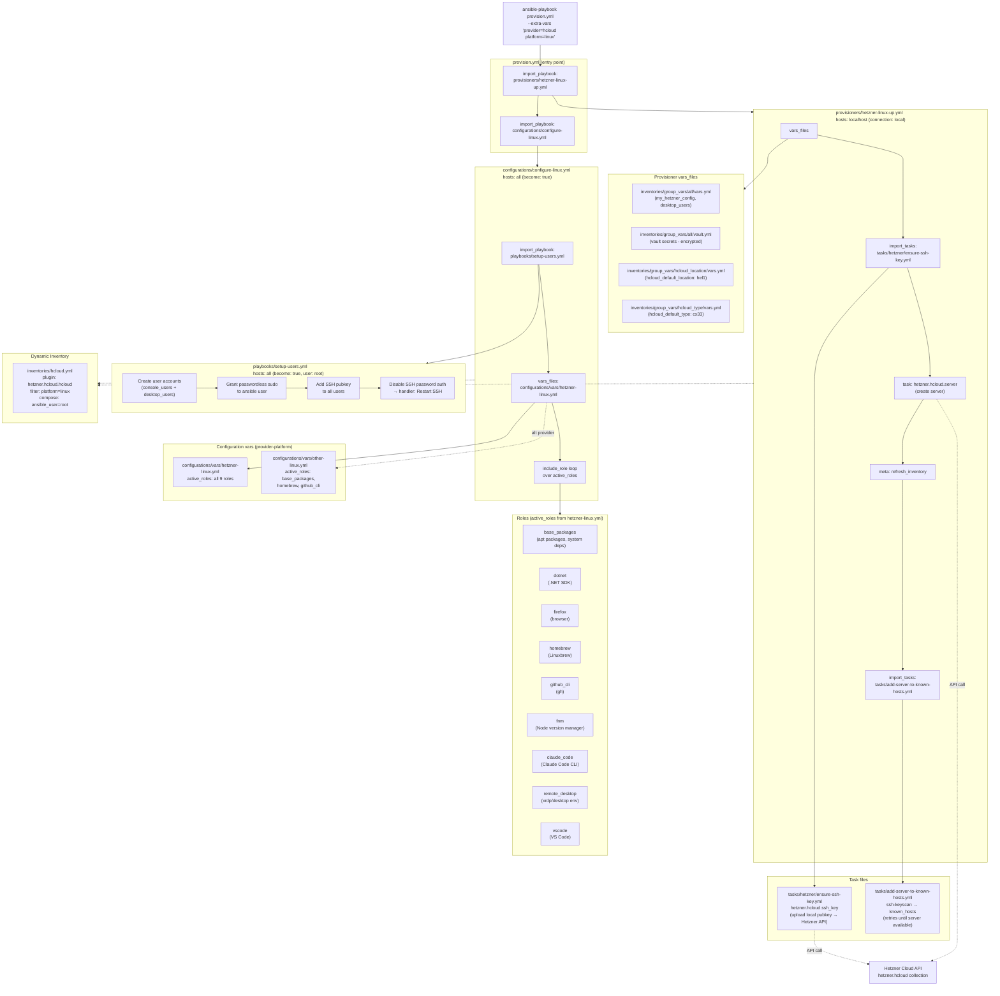

# Provision Architecture

## Flow Summary

1. **Provision phase** — `hetzner-linux-up.yml` runs on `localhost`, uploads SSH key to Hetzner API, creates the cloud server, scans + trusts its host key.
2. **Configure phase** — `configure-linux.yml` runs on the new server (via dynamic inventory). First creates user accounts and hardens SSH (`setup-users.yml`), then loops over `active_roles` to install the full software stack.
3. **Role set** is provider-specific: `hetzner-linux.yml` activates all 9 roles; `other-linux.yml` activates only 3.
4. **Secrets** flow from `vault.yml` (Ansible Vault encrypted) → `vars.yml` → provisioner + configure plays.
